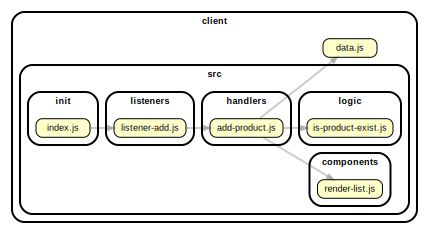

<!-- BEGIN TITLE -->

# DOCS

<!-- END TITLE -->

<!-- BEGIN TREE -->

> [interactive graph](./dependency-graph.html)

<!-- END TREE -->

<!-- BEGIN TOC -->

- public
- src
  - components
    - [render-list.js](#clientsrccomponentsrender-listjs)
  - handlers
    - [add-product.js](#clientsrchandlersadd-productjs)
  - init
    - [index.js](#clientsrcinitindexjs)
  - listeners
    - [listener-add.js](#clientsrclistenerslistener-addjs)
  - logic
    - [is-product-exist.js](#clientsrclogicis-product-existjs)
- styles
- [data.js](#clientdatajs)

---

<!-- END TOC -->

<!-- BEGIN DOCS -->

# /public

---

# /src

## /components

<a href="../../client/src/components/render-list.js" id="clientsrccomponentsrender-listjs">../client/src/components/render-list.js</a>

---

## /handlers

<a href="../../client/src/handlers/add-product.js" id="clientsrchandlersadd-productjs">../client/src/handlers/add-product.js</a>

---

## /init

<a href="../../client/src/init/index.js" id="clientsrcinitindexjs">../client/src/init/index.js</a>

---

## /listeners

<a href="../../client/src/listeners/listener-add.js" id="clientsrclistenerslistener-addjs">../client/src/listeners/listener-add.js</a>

---

## /logic

<a href="../../client/src/logic/is-product-exist.js" id="clientsrclogicis-product-existjs">../client/src/logic/is-product-exist.js</a>

---

---

# /styles

---

<a href="../../client/data.js" id="clientdatajs">../client/data.js</a>

<!-- END DOCS -->
